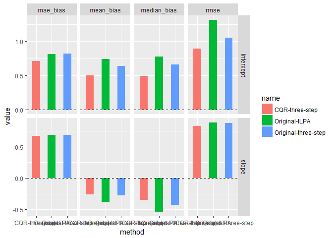

Simulation for Table 1.
================
ShotaYasui
2017年6月2日

read libraries
--------------

    ## 
    ## Attaching package: 'dplyr'

    ## The following objects are masked from 'package:stats':
    ## 
    ##     filter, lag

    ## The following objects are masked from 'package:base':
    ## 
    ##     intersect, setdiff, setequal, union

    ## Warning: package 'quantreg' was built under R version 3.3.3

    ## Loading required package: SparseM

    ## Warning: package 'SparseM' was built under R version 3.3.3

    ## 
    ## Attaching package: 'SparseM'

    ## The following object is masked from 'package:base':
    ## 
    ##     backsolve

    ## Warning: package 'tidyr' was built under R version 3.3.3

    ## Warning: package 'ggplot2' was built under R version 3.3.3

    ## 
    ## Attaching package: 'CQR'

    ## The following object is masked from 'package:stats':
    ## 
    ##     pt

MonteCarlo Simulation
---------------------

### Set up parameters

``` r
repetitions <- 1000
N <- 1000
N_est <- 400
cut_value <- -0.75

taus <- 0.5
q1 <- 0.1
q2 <- 0.03

param_true <- c(1, 1, 0.5, -1, -0.5, 0.25)
```

N\_est is the number of observation used in estimation. N is number of simulation sample in one repetition. N\_est is chosed from N.

### Simulation and Estimation part

``` r
MS_df <- matrix(nrow = repetitions, ncol = 6)
robust_stat <- matrix(nrow = repetitions, ncol = 3)

for(rep in 1:repetitions){

#set up X_i i in 1:5
data <- data.frame(
  X1 = rnorm(n = N, 0, 1),
  X2 = rnorm(n = N, 0, 1),
  X3 = rnorm(n = N, 0, 1),
  X4 = rnorm(n = N, 0, 1),
  X5 = rnorm(n = N, 0, 1))

#make |X_i| < 2
data <- data[ifelse(apply(data,1,max) > 2, F, T), ]
data <- data[sample(NROW(data), N_est, replace = F), ]

#make u ~ N(0, 25)
u <- rnorm(n = N_est, 0, 5)

#make eps
hetero_factor <- apply(data + data^2, 1, sum)
eps <- u * (1 + 0.5 * hetero_factor)

#make y
y <- cbind(1,as.matrix(data)) %*% param_true + eps

#make y as censored data with cut_value which is -0.75 in the original papaer
y <- ifelse(y < cut_value, cut_value, y)

#finally obtained dataset of (1, X_i, y)
data <- data %>% cbind(y) 

#getting into three step estimation
#1st step
YV <- "y" #dependent variable
XV <- paste("X", 1:5, sep = "") #independent variables

#rename dataset this part might be troublesome in large dataset
cqr_data <- data

#prepare X_i^2 as the original paper(this part should be modified for your dataset)
#original paper changed this part in the extramarital affairs example
sq_extra <- cqr_data %>% 
  select_(paste("-",YV, sep = "")) %>% 
  mutate_at(vars(-matches(YV)), pt, n = 2)

colnames(sq_extra) <- paste("sq_", colnames(sq_extra), sep = "")

#bind into original dataset then make binary variable which indicates the y is censored or not.
lr_extra <- cbind(cqr_data, sq_extra) %>%
  mutate(binom_var = ifelse(y > cut_value, 1, 0))

#run the logistic regression of first step
first_logit <- glm(lr_extra, formula = paste("binom_var ~ . -", YV), family = binomial())

#run the second step and third step
#you will get summary of the third step model and robustnes stats to check whether J0 is subset of J1.
three_step_result <- two_three_step(first_step_model = first_logit, 
                                    taus = taus, 
                                    q1 = q1, 
                                    q2 = q2, 
                                    YV = YV, 
                                    XV = XV, 
                                    cqr_data = cqr_data)

#get the coefficients of third step
MS_df[rep, ] <- three_step_result[[1]][[1]]$coefficients[,1]

}
```

As you may noticed, first step and second and third step are separated. This is because first step is something you need to modify with your dataset.

comparison of the results
-------------------------

``` r
three_step <- stats_result(df = MS_df[,1:2], param_true = param_true[1:2]) %>% cbind(name = "CQR-three-step")

intercept <- c(1.05, 0.64, 0.82, 0.66)
slope <- c(0.88, -0.28, 0.69, -0.43)
orig_res <- rbind(intercept,slope) %>% cbind(names = "Original-three-step")

intercept <- c(1.31, 0.74, 0.81, 0.78)
slope <- c(0.89, -0.38, 0.69, -0.54)
ILPA_res <- rbind(intercept,slope) %>% cbind(names = "Original-ILPA")

comp_data <- rbind(three_step, orig_res, ILPA_res)
comp_data %>% cbind(varname = row.names(comp_data)) %>%
  as.data.frame() %>%
  gather(vid, value, -c(name, varname)) %>%
  mutate(value = as.numeric(value)) %>%
  ggplot(aes(y = value, x = name, fill = name)) +
  geom_bar(stat = "identity", width = 0.5) + 
  facet_grid(varname ~ vid, scales = "free") + 
  geom_hline(yintercept = 0, linetype = 2) +
  xlab("method")
```

    ## Warning: attributes are not identical across measure variables; they will
    ## be dropped



-   As in the original paper, evaluation is taken with rmse, mean\_bias, mae\_bias and median\_bias. Slope is evaluated with first slope coefficient.
-   This evaluation process is what implemented in Buchinsky and Hahn(1998).
-   Original-three-step is copied from Table.1 in the original paper.
-   ILPA is the iterated LP estimation which is introduced in Powell-Buchinsky(1994).
-   three-step is the result that is estimated in the above simulation process.
-   The result is not exactly the same with original one, but it is quite close and well performed.
-   As a conclusion, my three-step estimator implementation does not have sivere problem.
